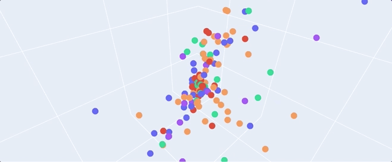
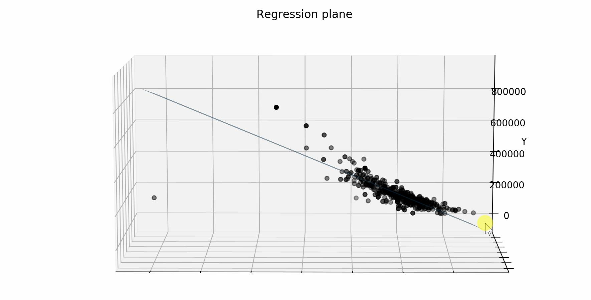
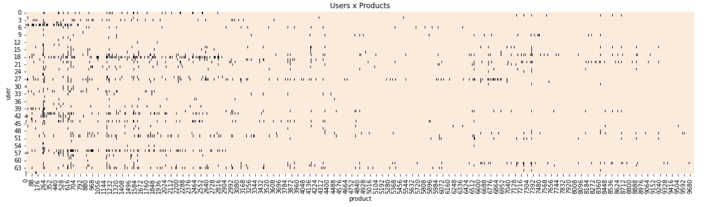
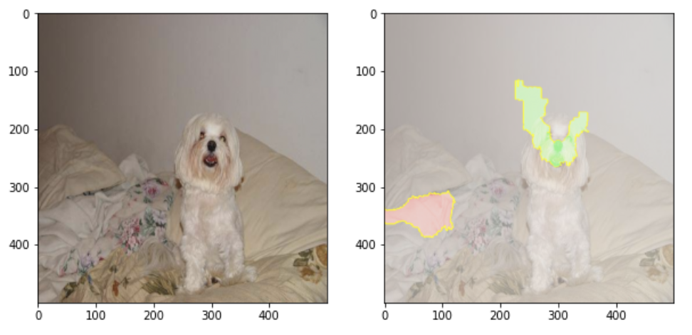

# Data Science & Artifical Intelligence with Python
This repo is a collection of Machine Learning, Deep Learning, Natural Language Processing and Computer Vision Projects. 

 

### 1. Machine Learning:
- <ins>**[Classification](https://github.com/nakhwashazmeen/Data-Science-Projects/blob/main/Machine%20Learning/Naive%20Bayes/SMSSpamCollection)**</ins>
 
	

 

- <ins>**[Regression](https://github.com/nakhwashazmeen/Data-Science-Projects/blob/main/Machine%20Learning/Cement%20Capstone%20Project.ipynb)**</ins>
 	
	

 

- <ins>**[Recommendation Systems](https://github.com/nakhwashazmeen/Data-Science-Projects/blob/main/Machine%20Learning/Spotify%20Recommendation%20System.ipynb)**</ins>
 
	

 

------

### 2. Time Series:
- <ins>**[Forecasting](https://github.com/nakhwashazmeen/Data-Science-Projects/tree/main/Time%20Series)**</ins>
	* work in progress

------

### 3. Natural Language Processing:
- <ins>**[Text classification](https://github.com/nakhwashazmeen/Data-Science-Projects/blob/main/Deep%20Learning%20%26%20NLP/Amazon%20Classification.ipynb)**</ins>
 
	

 

------

### 4. Computer Vision:
- <ins>**[Image classification](https://github.com/nakhwashazmeen/Data-Science-Projects/blob/main/Computer%20Vision/Introduction%20to%20CNN.ipynb)**</ins>
 
	

 

- <ins>**[Object detection](https://github.com/nakhwashazmeen/Data-Science-Projects/blob/main/Computer%20Vision/Computer%20Vision%20Case%20Study%20(1).ipynb)**</ins>
 
	

 

------
